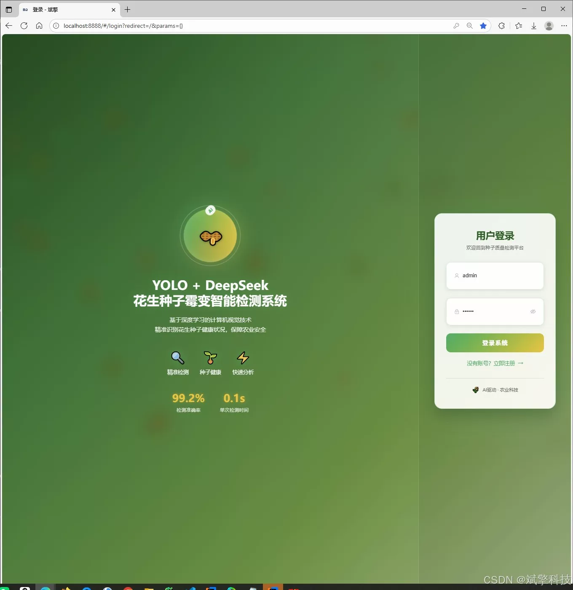
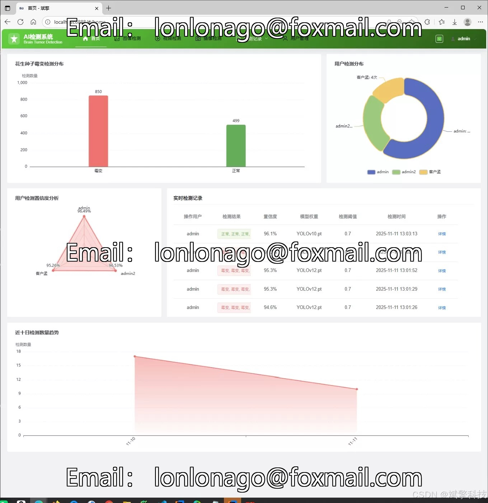
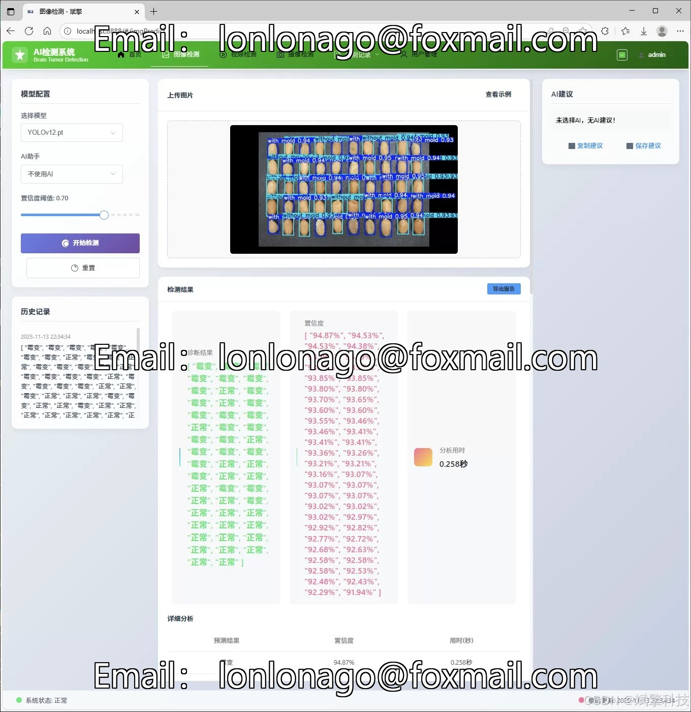
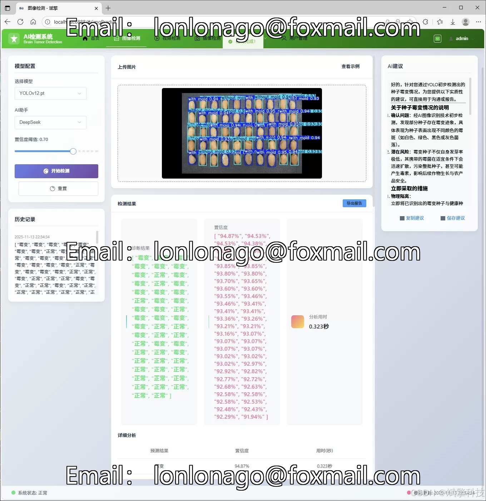
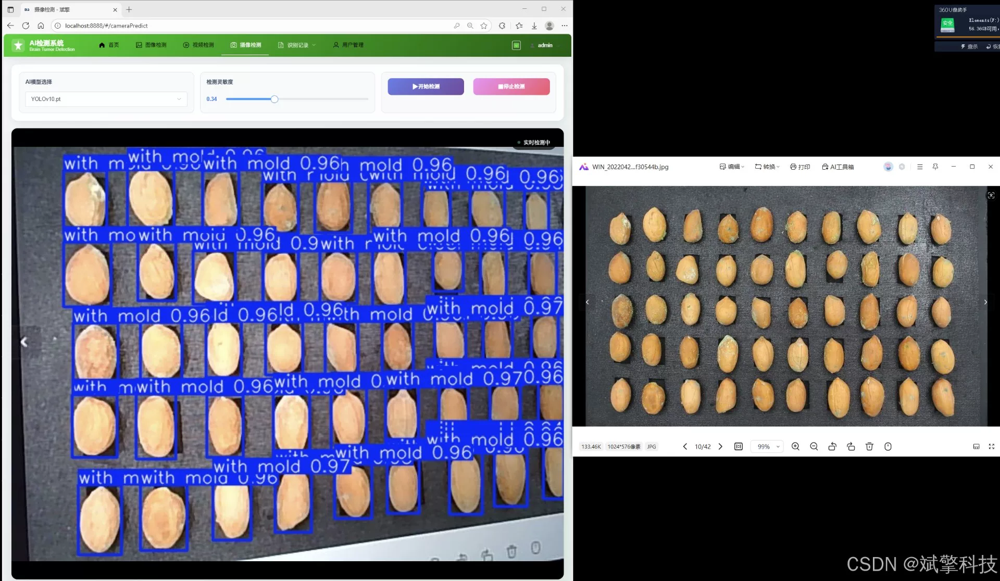
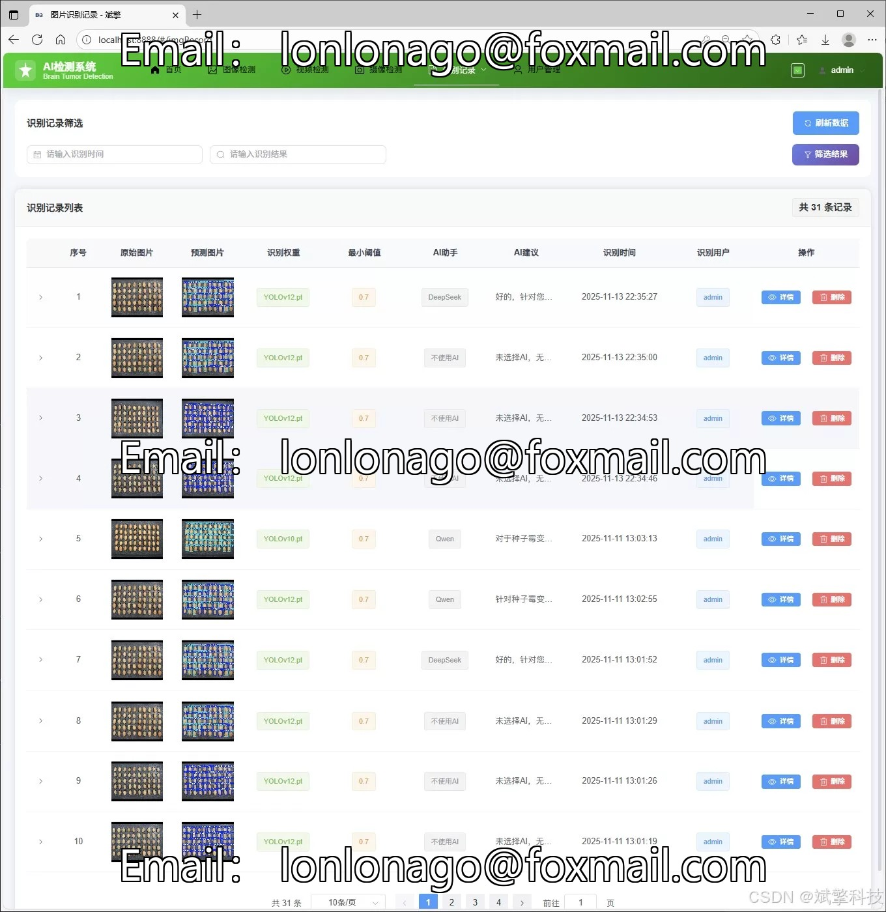
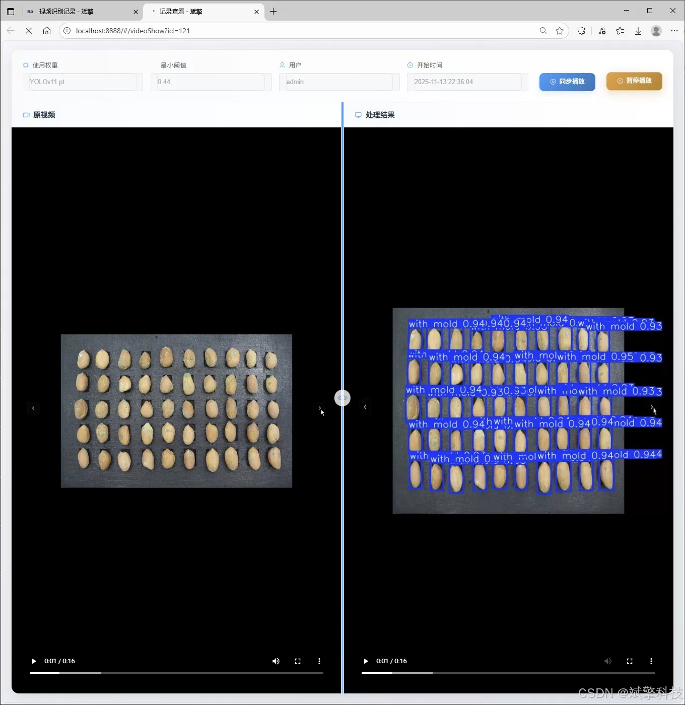
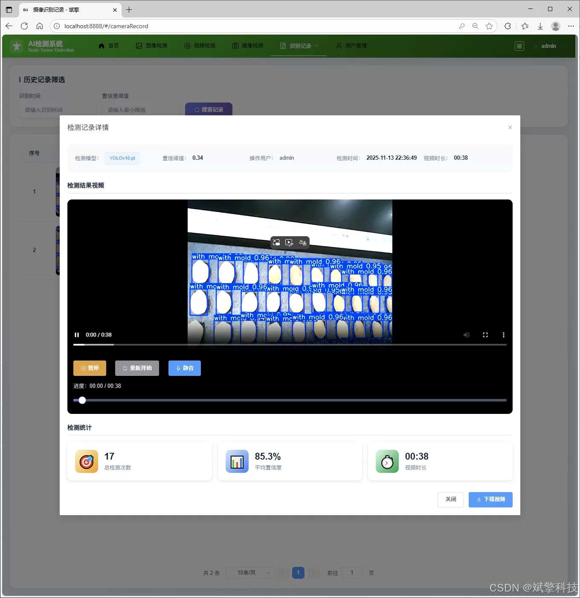
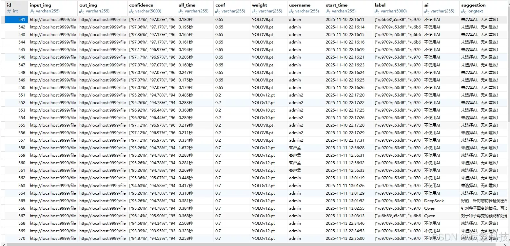

# YOLO+DeepSeek peanut mold detection

## Body

YOLO+DeepSeek peanut mold detection system based on YOLO deep learning and big models of Qianwen and DeepSeek peanut seeds mold identification detection system (DeepSeek intelligent analysis + web interaction interface + front-end separation + YOLO data + YOLOv8/YOLOv10/YOLOv11/YOLOv12)

This project aims to develop a peanut seed mold detection and identification system based on deep learning and Web technologies, featuring a separation of the frontend and backend. The core of the system utilizes advanced YOLOv8/v10/v11/v12 series object detection models for efficient and precise binary classification of peanut seed images (‘with mold’ molded / ‘without mold’ normal). The backend is constructed using SpringBoot framework to create a RESTful API, while the frontend provides a user-friendly web interaction interface, achieving functions such as user management, multimodal detection (images, videos, real-time cameras), visualization of AI analysis results, and data management. The system innovatively integrates DeepSeek intelligent analysis to enhance detection capabilities and persists all recognition records with user information in a MySQL database. This system provides an automated and visual solution for agricultural quality control, effectively improving the efficiency and accuracy of peanut mold detection.

Functional module

✅ Information Visualization, Data Visualization.

✅ Image detection supports AI analysis functions, deepseek and Qianwen.

✅ Supports image detection, video detection, and real-time camera detection. The results are saved to a MySQL database.

✅ Picture recognition record management, video recognition record management and camera recognition record management.

✅ User Management Module, administrators can add, delete, modify, and query users.

✅ Personal center, can modify their own information, password name profile picture and so on.

There is no Lunwen writing service, nor any Lunwen.

## Images

## Payment

Here is a pay link on Stripe ( https://buy.stripe.com/3cs8yP7sY87d0vu9AB ). Please contact me lonlonago@foxmail.com after funding $89, and I will send you a complete data files , thank you!

